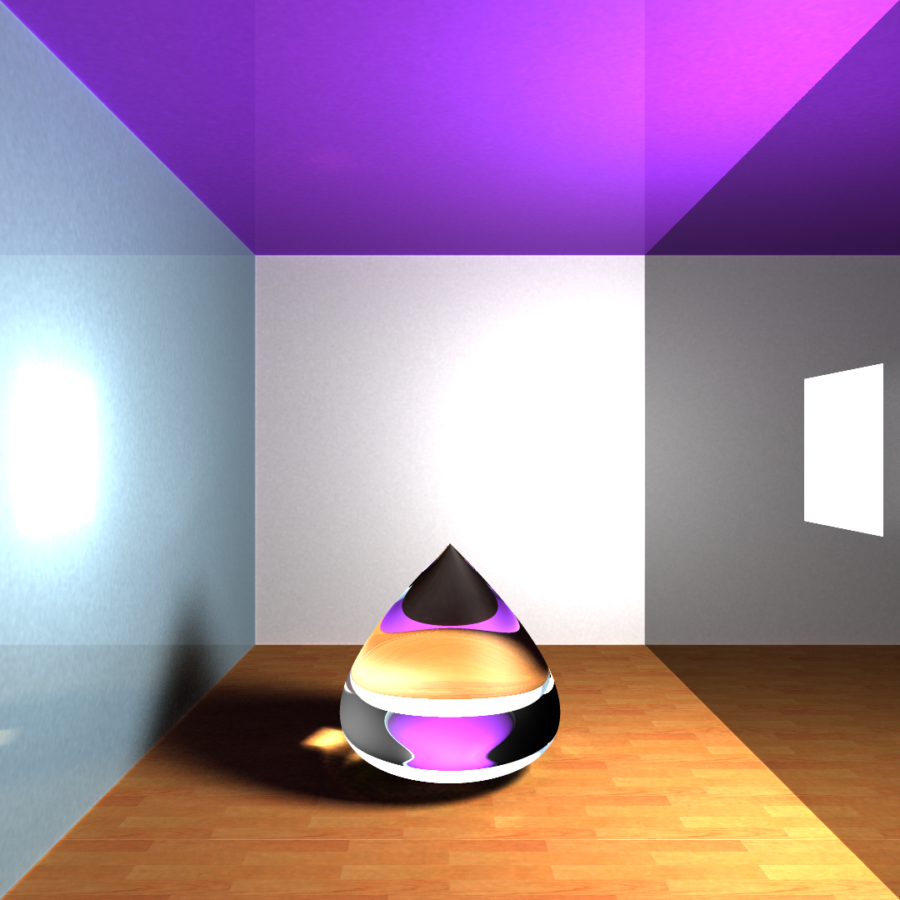
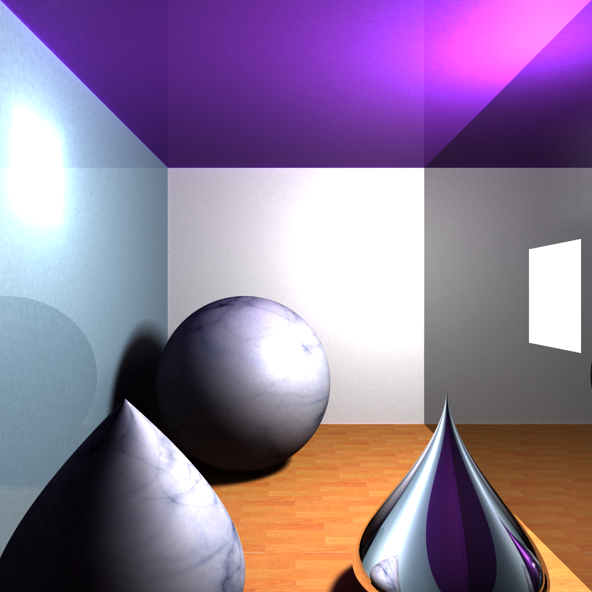
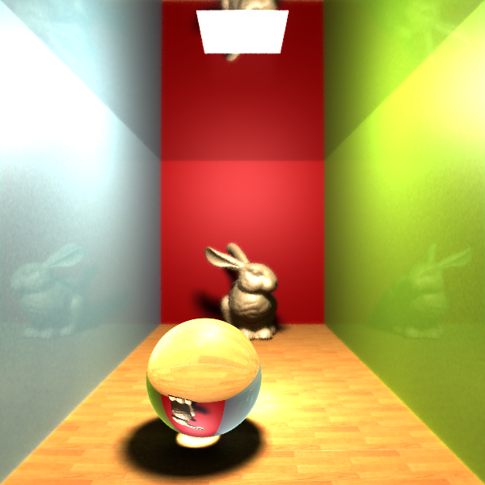
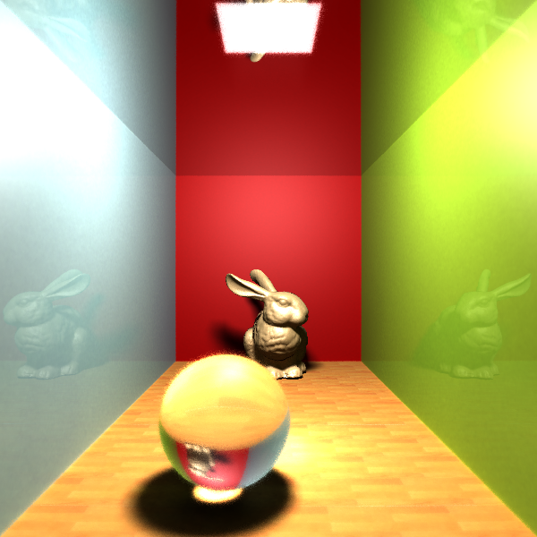
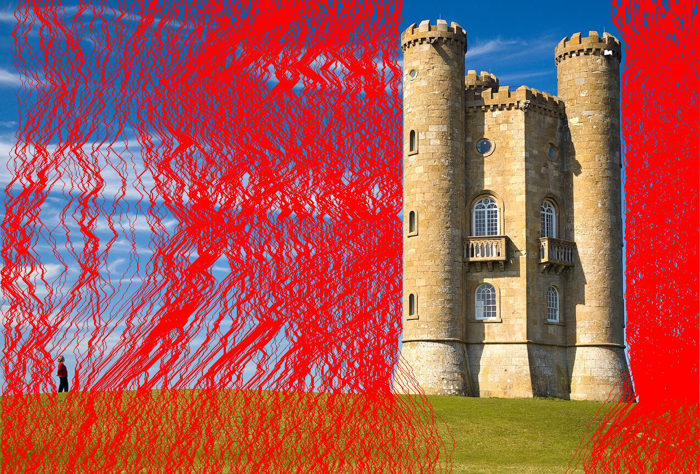
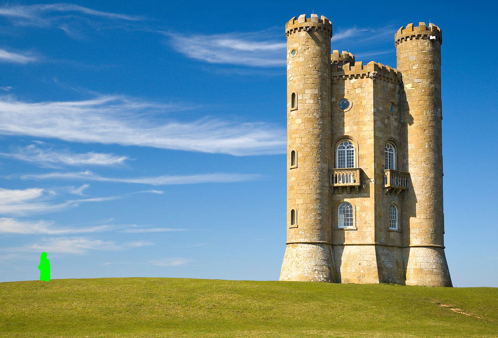
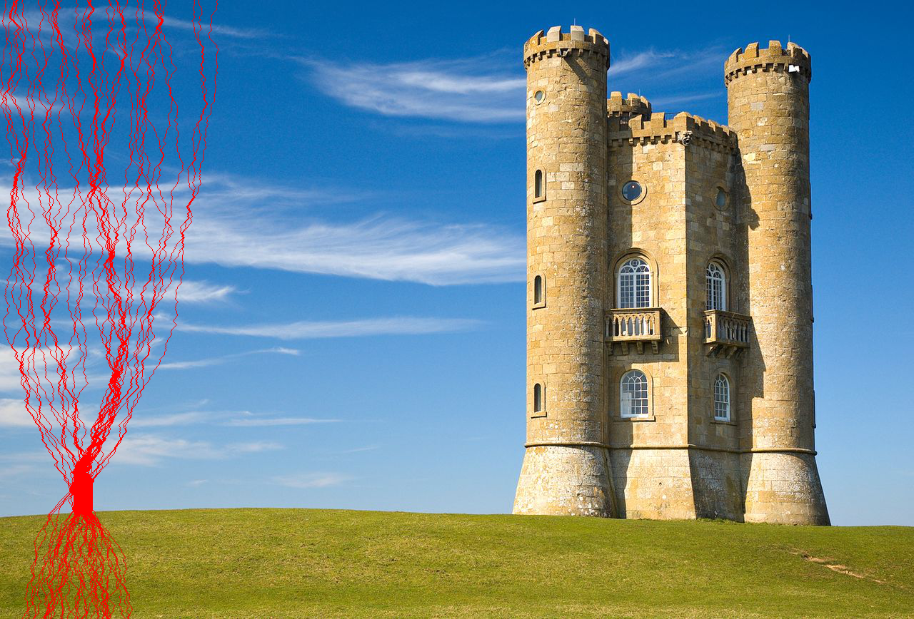
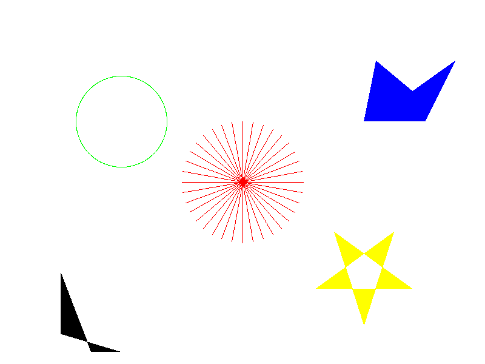

# graphics

## 编译&运行

```sh
> git submodule update --init --recursive
> mkdir build
> cd build
> cmake ..
> make -j
```

## hermes

光线追踪+渐进式光子映射

<div align="center"></div>

<div align="center"></div>

<div align="center"></div>

<div align="center"></div>

## poseidon

SeamCarving图像缩放算法

<div align="center"></div>

<div align="center"></div>

<div align="center"></div>

<div align="center"></div>

<div align="center"></div>

<div align="center"></div>

## zeus

光栅图形学作业

<div align="center"></div>
