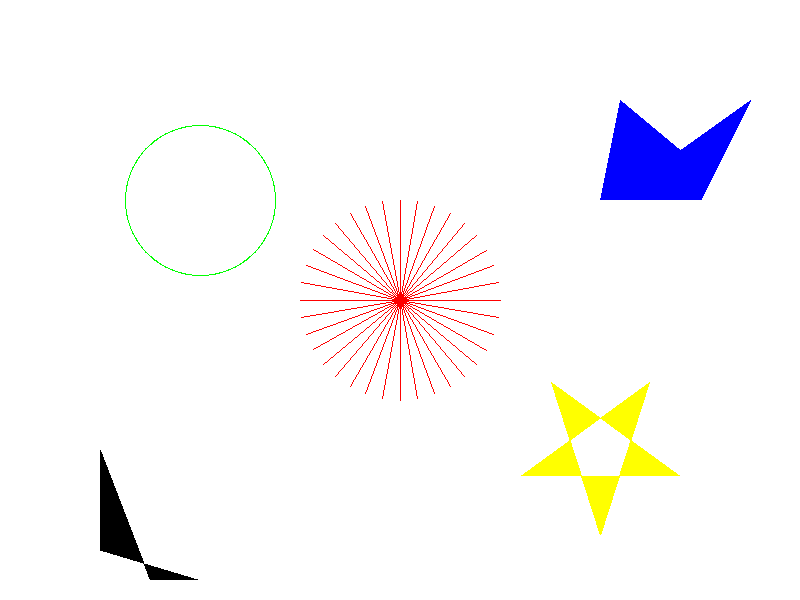

# 光栅图形学作业

### 实现的功能

- 绘制线段
- 绘制圆
- 多边形区域填充
- 简单的反走样

### 结果图

不开启反走样：


开启反走样：


### 算法说明

#### 绘制线段

对于线段(点A<->B点)的绘制，枚举A的横坐标和B的横坐标之间的每一个值，根据比例计算出该横坐标下对应的纵坐标值（四舍五入），该点即位于A与B的连线上，需要被绘制。

同时，为了避免A的横坐标和B的横坐标相差太小带来的失真，对A的纵坐标和B的纵坐标之间的每一个值也要用类似的方式处理一遍。

最终被绘制的点是上面两次计算出点的并集。

#### 绘制圆

给定需要绘制的圆的半径$r$，可计算出该圆的周长$2*\pi*r$，则可用$\lfloor 2*2*\pi*r \rfloor$个点对圆进行近似；将这些点按照角度平均分配到圆周上，通过三角函数计算出他们的近似位置（四舍五入），对计算出的点进行绘制，即可得到圆。

#### 绘制多边形

给定需要绘制的多边形的点序列，计算出这些点的$x_{min}$和$x_{max}$，然后对在这之间的每个$x$，均计算出有哪些点和多边形相交，将这些点按照$y$排序，相邻的两个点构成一组，则在这两个点之间的每个点均需要被绘制。

#### 反走样

对于上面的三种绘制情况，记录下被绘制的所有点，然后计算出其临近的点；对于这些临近的点，通过统计他的颜色和他周围的颜色，按照加权平均的算法，得出临近点的新颜色。


### 主要代码说明

#### Image类

`Image`类负责读取/写入图片，以及提供对图片像素级的操作。

`Image`类的读取和写入图片都是调用libpng的相关函数实现，本身记录了图片的类型和每个像素的RGB值，提供对外访问和修改像素的接口。

主要接口如下：

```c++
/// 处理图片相关的功能，不包括绘图
class Image
{
public:
    enum ColorType{RGB, RGBA};
    typedef std::shared_ptr<Image> ptr;

	// some static functions

    Image(int height, int width);
    ~Image();

    void save(const std::string& filename);
    
    int height();
    int width();
    ColorType type();
    /// x: [0:h-1]; y: [0:w-1]
    Pixel* getPixel(int x, int y);
    void setPixel(int x, int y, Pixel pixel);
    // ... other functions
};
```

#### Panel类

`Panel`类表示画板，所有的绘制过程均调用`Panel`的相关函数实现；每个`Panel`对象会维护一个`Image`对象，所有的绘制过程，最终都会落在该`Image`对象上。

`Panel`类的主要接口如下：

```c++
// 二维世界，坐标和图片无关
class Panel
{
    // 抗锯齿的范围
    const static int AA_RANGE = 4;
    const static int AA_CENTER_W = 3;
public:
    /// 高度，宽度，是否反走样
    Panel(int height, int width, bool AA = false);
    ~Panel();

    /// 画线
    void drawLine(int x1, int y1, int x2, int y2, Pixel pixel);
    /// 画圆
    void drawCircle(int x, int y, int r, Pixel pixel);
    /// 画多边形
    void drawPolygon(std::vector<Pointi> points, Pixel pixel);

    void save(const std::string& filename);
};
```

#### 几何相关

由于代码中需要大量运用到和几何处理相关的函数，所以我在设计的时候，将几何公共的部分提取出来，放在`geometry.h`和`geometry.cpp`中，方便其他代码调用。

### 外部依赖

- `libpng`：读取和写入png图片
- `plog`:输出Log